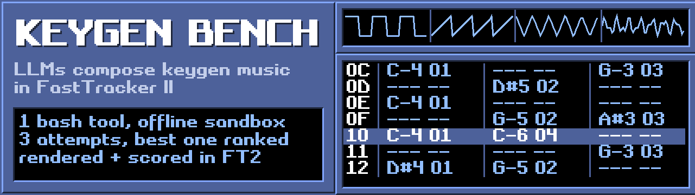

<p align="center">
  
</p>

---

keygen bench is a benchmark for language models composing tracker music in FastTracker II. a model gets one bash tool in an offline Docker sandbox, writes an XM module, and submits it. the module is then rendered in a fresh FT2 process and scored outside the sandbox.

this repository has the runner, the pinned container build, the evaluator, the results website, every recorded run and the community submission tools. it contains no keygens, cracks or license-bypass code. the name is about the music.

[results](https://keygen.micr.dev) | [scoring](https://keygen.micr.dev/scoring) | [submit a run](CONTRIBUTING-RUNS.md) | [benchmark guide](benchmark/README.md) | [support](https://keygen.micr.dev/support)

## how a model is ranked

- every model runs the same prompt (prompt v2) at the highest reasoning tier its route accepts, with the same frozen limits: 120 minutes per attempt, 120 seconds per command, no step limit.
- each model gets three independent attempts. the leaderboard ranks the best of the three; failures stay visible next to it.
- an attempt that fails for infrastructure reasons (provider outage, quota, network) can be rerun. a rerun never replaces an attempt that produced a score, and the replaced attempt stays listed.
- costs are estimates: recorded tokens times the provider's published API price. models that are free on their maker's API show $0.

## scoring

the evaluator renders the submitted XM at 44.1 kHz / 16-bit in a fresh FT2 process. craft-v7 measures tonal organization, development and dynamics, with adjustments for clean audio, loop continuity and duration. it is an auxiliary diagnostic, not a validated measure of musical quality. listen to the music before reading a score as a preference.

## run a model

start with [contributing runs](CONTRIBUTING-RUNS.md). the guided CLI builds the environment, configures a provider, checks prerequisites and runs a smoke attempt or the full three-attempt submission. API-key presets include OpenAI and Anthropic; other services can use compatible Chat Completions, Responses or Messages endpoints. OAuth routes use your own authorized local bridge.

model requests can cost money. credentials stay outside the model's sandbox and must never be committed. keep your working runs outside the repository and publish only reviewed bundles.

community submissions stay labelled separately until the maintainer verifies their provenance and re-renders and re-scores the module. the bundle validator can't prove which model produced a file or that no undisclosed attempts happened.

for campaign configuration, evaluation and reporting, see [the benchmark guide](benchmark/README.md).

## runs

every attempt behind the published results is in [`runs/`](runs/README.md), one folder per model:

```text
runs/<model>/
  attempt-1/ attempt-2/ attempt-3/   the three ranked attempts
  other/                             failed, retried, quota and older runs, other services
```

each attempt keeps the full model conversation, the submitted `tune.xm`, the trusted render and its scores. videos are left out and audio is stored as lossless FLAC (`flac -d --keep-foreign-metadata` restores the exact WAV).

## repository layout

| path | purpose |
| --- | --- |
| `benchmark/` | campaign runner, provider adapters, prompts, container build and evaluator |
| `benchmark/contrib/` | community-run packaging and validation |
| `benchmark/tests/`, `tests/` | offline regression tests and synthetic fixtures |
| `scripts/`, `tools/` | pinned FT2 builds and native acceptance checks |
| `runs/` | every recorded attempt of the maintainer campaigns, by model |
| `data/` | scoring calibration metadata, without archived music |
| `web/classic/` | results website and publication tools |
| `submissions/` | reviewed community bundles |

## development

for code or documentation changes, follow [AGENTS.md](AGENTS.md). it links the task guides and sets the privacy, provenance and verification rules.

use the pinned requirements and build steps from the benchmark guide. the tests make no paid model calls:

```sh
python -m unittest discover -s benchmark/tests
python -m unittest discover -s tests
node --test tests/test_classic_player.mjs tests/test_classic_rankings.mjs
```

some integration tests need the pinned dependencies or a native FT2 build. passing offline tests doesn't establish provider access, musical quality or production readiness.

## support

runs are paid out of pocket. if you want more models tested, you can chip in through [github sponsors](https://github.com/sponsors/Microck), [ko-fi](https://ko-fi.com/microck) or [crypto](https://keygen.micr.dev/crypto).

## license and attribution

no project-wide license has been chosen yet for the code and docs. third-party material keeps its own terms: the FT2 fonts and graphics are CC BY-NC-SA 4.0 and the FT2 build pins `8bitbubsy/ft2-clone` via a fork. see [NOTICE.md](NOTICE.md) for the full list and [the public-launch checklist](PUBLIC-LAUNCH.md) before publishing a formerly private checkout.

to cite keygen bench, use [CITATION.cff](CITATION.cff) with the commit your experiment used.
